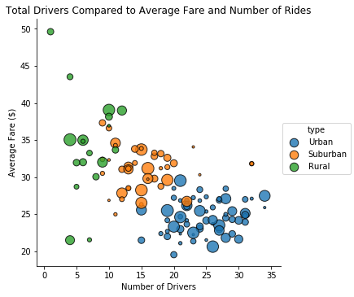
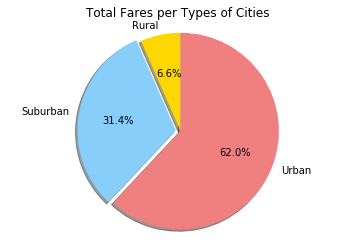
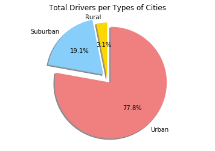

# Analysis

1. People in Urban areas utilize ride sharing more than other areas. 67.5%
    of the ride sharing happens in urban areas. 
2. There are more drivers in Urban Areas at almost 78%
2. The Average fare starts to stabilize as the number of drivers increase.


```python
import matplotlib.pyplot as plt
import pandas as pd
import numpy as np
import seaborn as sns
```


```python
# Take in all of our wrestling data and read it into pandas
city_data = "raw_data/city_data.csv"
ride_data = "raw_data/ride_data.csv"

city_df = pd.read_csv(city_data)
ride_df = pd.read_csv(ride_data)
print(len(city_df))
print(len(ride_df))
```

    126
    2375


```python
ride_per_city_df = ride_df.groupby('city').fare.agg(['count','mean','sum'])
ride_per_city_df = ride_per_city_df.reset_index()

print(city_df.head())
print(ride_per_city_df.head())
```

                 city  driver_count   type
    0      Kelseyland            63  Urban
    1      Nguyenbury             8  Urban
    2    East Douglas            12  Urban
    3   West Dawnfurt            34  Urban
    4  Rodriguezburgh            52  Urban
               city  count       mean     sum
    0  Alvarezhaven     31  23.928710  741.79
    1    Alyssaberg     26  20.609615  535.85
    2    Anitamouth      9  37.315556  335.84
    3  Antoniomouth     22  23.625000  519.75
    4  Aprilchester     19  21.981579  417.65


```python
city_ride_df = pd.merge(ride_per_city_df, city_df, how='left', on='city')
city_ride_df.head()
```


<div>
<style scoped>
    .dataframe tbody tr th:only-of-type {
        vertical-align: middle;
    }

    .dataframe tbody tr th {
        vertical-align: top;
    }

    .dataframe thead th {
        text-align: right;
    }
</style>
<table border="1" class="dataframe">
  <thead>
    <tr style="text-align: right;">
      <th></th>
      <th>city</th>
      <th>count</th>
      <th>mean</th>
      <th>sum</th>
      <th>driver_count</th>
      <th>type</th>
    </tr>
  </thead>
  <tbody>
    <tr>
      <th>0</th>
      <td>Alvarezhaven</td>
      <td>31</td>
      <td>23.928710</td>
      <td>741.79</td>
      <td>21</td>
      <td>Urban</td>
    </tr>
    <tr>
      <th>1</th>
      <td>Alyssaberg</td>
      <td>26</td>
      <td>20.609615</td>
      <td>535.85</td>
      <td>67</td>
      <td>Urban</td>
    </tr>
    <tr>
      <th>2</th>
      <td>Anitamouth</td>
      <td>9</td>
      <td>37.315556</td>
      <td>335.84</td>
      <td>16</td>
      <td>Suburban</td>
    </tr>
    <tr>
      <th>3</th>
      <td>Antoniomouth</td>
      <td>22</td>
      <td>23.625000</td>
      <td>519.75</td>
      <td>21</td>
      <td>Urban</td>
    </tr>
    <tr>
      <th>4</th>
      <td>Aprilchester</td>
      <td>19</td>
      <td>21.981579</td>
      <td>417.65</td>
      <td>49</td>
      <td>Urban</td>
    </tr>
  </tbody>
</table>
</div>


## Bubble Plot


```python
x_axis = city_ride_df['driver_count']
data = city_ride_df['mean']
total = city_ride_df['sum']

plt.figure(figsize=(15,8))
plt.scatter(x_axis, data, marker='o', facecolor='Blue', edgecolors='black', sizes=total, alpha=0.75)
#plt.scatter(x_axis, data, marker='o',c=city_ride_df['sum'], s=city_ride_df['count'],cmap='viridis', sizes=data*10, alpha=0.75)

data = city_ride_df['count']
plt.scatter(x_axis, data, marker='o', facecolor='Green', edgecolors='black', sizes=total, alpha=0.75)

plt.title('Total Drivers Compared to Average Fare and Number of Rides')
plt.xlabel("Number of Drivers")
plt.legend(['Average Fare/City','Total Fare/City'])
plt.show()
```





## % of Total Fares by City Type


```python
grouped_by_type = city_ride_df.groupby('type')

grouped_sum_by_type = grouped_by_type['sum'].sum()
grouped_sum_by_type = grouped_sum_by_type.reset_index()

#print(grouped_sum_by_type)
#print(grouped_by_type.head())

pie_labels = grouped_sum_by_type['type']
pie_data = grouped_sum_by_type['sum']

colors = ["Gold", "lightskyblue", "lightcoral"]
explode = (0, 0.05, 0)

plt.pie(pie_data, explode=explode, labels=pie_labels, colors=colors,autopct="{:.1f}%".format, shadow=True, startangle=90)
plt.axis("equal")

plt.title("Total Fares per Types of Cities")

plt.show()
```





## % of Total Rides by City Type


```python
grouped_rides_by_type = grouped_by_type['count'].sum()
grouped_rides_by_type = grouped_rides_by_type.reset_index()

#print(grouped_rides_by_type)
#print(grouped_by_type.head())

pie_labels = grouped_rides_by_type['type']
pie_data = grouped_rides_by_type['count']

colors = ["Gold", "lightskyblue", "lightcoral"]
explode = (0,0.05,0.05)

plt.pie(pie_data, explode=explode, labels=pie_labels, colors=colors,autopct="{:.1f}%".format, shadow=True, startangle=90)
plt.axis("equal")

plt.title("Total Rides per Types of Cities")

plt.show()
```


## % of Total Drivers by City Type


```python
grouped_drivers_by_type = grouped_by_type['driver_count'].sum()
grouped_drivers_by_type = grouped_drivers_by_type.reset_index()

#print(grouped_rides_by_type)
#print(grouped_by_type.head())

pie_labels = grouped_drivers_by_type['type']
pie_data = grouped_drivers_by_type['driver_count']

colors = ["Gold", "lightskyblue", "lightcoral"]
explode = (0, 0.1, 0.1)

plt.pie(pie_data, explode=explode, labels=pie_labels, colors=colors,autopct="{:.1f}%".format, shadow=True, startangle=90)
plt.axis("equal")

plt.title("Total Drivers per Types of Cities")

plt.show()
```




